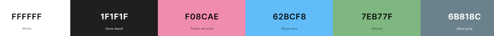

# Charlie-Portfolio
This is my personal portfolio website

## Design

### Fonts

[Fire Code](https://fonts.google.com/specimen/Fira+Code) - headings and code text

[Nunito](https://fonts.google.com/specimen/Nunito) - normal text

### Color Scheme

- White - all normal text color
- Eerie Black - page background color, text color on white background
- Charm Pink - links, nav bar item hover, icon hover color
- Maya Blue - Charm Pink links hover color
- Divine Green - project skill text color
- Slate Gray - mobile navbar background color

## Built With

- [HTML5](https://www.w3schools.com/html/)
- [CSS3](https://www.w3schools.com/css/)
- [JavaScript](https://www.w3schools.com/js/DEFAULT.asp)
- [Flaticon](https://www.flaticon.com/) and [FontAwesome](https://fontawesome.com/v5.15/icons?d=gallery&p=1) for the icons
- [Figma](https://www.figma.com/) for design and prototyping tools
- [Balsamiq](https://balsamiq.com/) for initial wireframe visualisation

---

## Creator / Maintainer

Charlie Joshi ([Charlie - @DoesDevStuff](https://github.com/DoesDevStuff))

If you have any questions, comments, or concerns, feel free to contact me below.

  

### License

Copyright &copy; 2022-2023 Charlie Joshi. All rights reserved.
